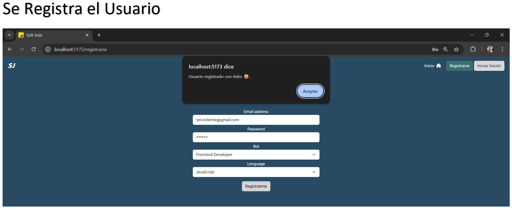
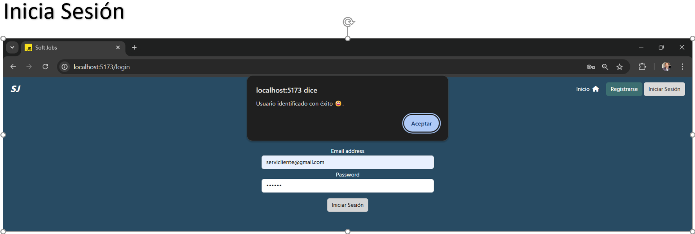
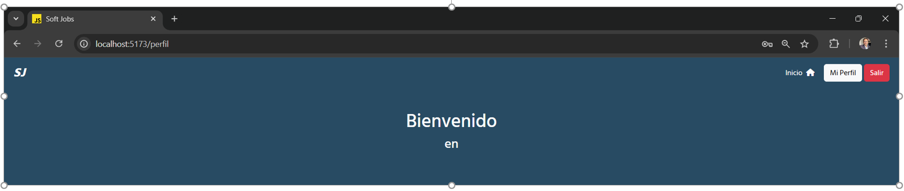

# Módulo 6 Backend con Node js y Express js - Desafío 6 - Autenticación y Autorización de Usuarios con JWT

## Presentación del Desafío

##  

## Descripción del PY ⌨️

La empresa Soft Jobs ha iniciado el desarrollo de una plataforma que busca apoyar a la
comunidad de desarrolladores juniors a conseguir trabajos cortos y sencillos para acumular
experiencia laboral y mejorar sus oportunidades. En este desafío como backend developer de la empresa crearé un servidor para la
autenticación y autorización de usuarios usando JWT.

## Requerimientos entregados:

1. Registrar y obtener usuarios de la base de datos.
2. Usar middlewares para:
   ● Verificar la existencia de credenciales en la ruta que corresponda.
   ● Validar el token recibido en las cabeceras en la ruta que corresponda.
   ● Reportar por la terminal las consultas recibidas en el servidor.
3. Firmar, verificar y decodificar tokens JWT.
4. Capturar y devolver los posibles errores que ocurran en el servidor.
5. Encriptar las contraseñas al momento de registrar nuevos usuarios.

Para ejecutar el PY:

1. Subir el servidor, ejecutando en el bash: node index.js (ubicarse en la carpeta backend).
2. Ejecutar en el bash: npm run dev (ubiucarse en la carpeta frontend).

Para realizar este desafío se ejecutó el siguiente script sql en la terminal psql, para crear la base de datos y la tabla necesaria:

CREATE DATABASE softjobs;
\c softjobs;

CREATE TABLE usuarios ( id SERIAL, email VARCHAR(50) NOT NULL, password VARCHAR(60) NOT NULL, rol VARCHAR(25), lenguage VARCHAR(20) );

SELECT \* FROM usuarios;

##  

## Tecnologías Usadas 🛠️

- **Backend:** Node.js, Express.js, Java js, JWT. 🧑‍💻
- **Frontend:** HTML, CSS, Bootstrap, React.
- **Almacenamiento:** BDD PostgreSQL. 🫙

 

---

## Autor 👨‍💻

**Luis Fernando Sanchez F. - Desarrollador Fullstack G60⚡**

Sígueme en mis redes sociales: 
 
